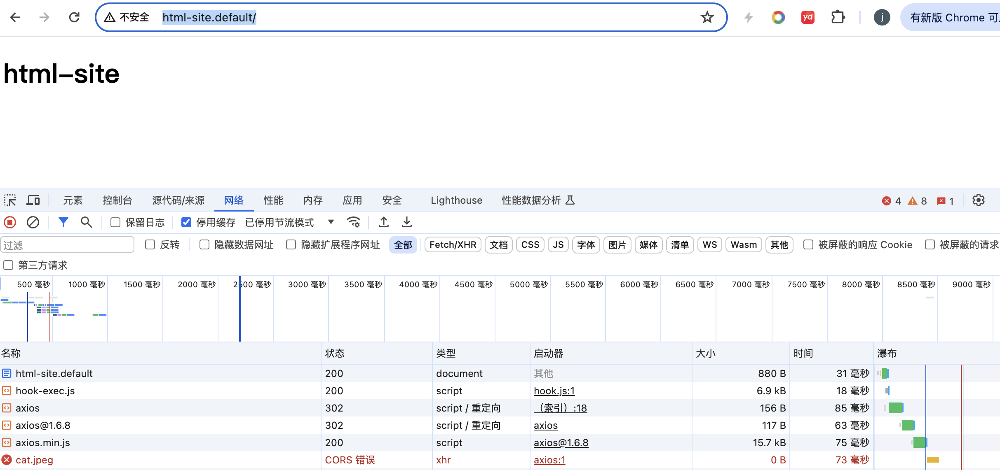
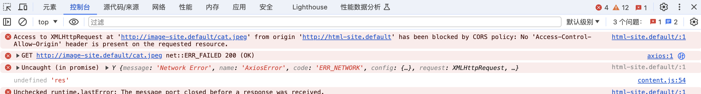
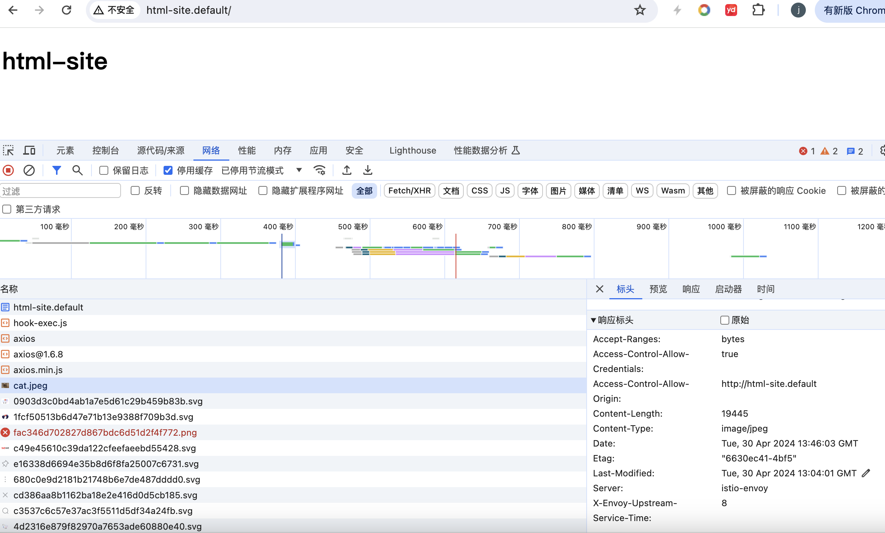

cd .......

# 构建镜像
```
cd ../html-site
docker build -t self/html-site .

cd ../image-site
docker build -t self/image-site .
```


# 上传到minikube
```
docker image save -o html.tar self/html-site
minikube image load html.tar
rm -f html.tar


docker image save -o image.tar self/image-site
minikube image load image.tar
rm -f image.tar
```

# 部署到k8s
```
kaf html-site/deployment.yaml
kaf image-site/deployment.yaml
kaf gateway.yaml
curl -H "HOST: html-site.default" -v http://127.0.0.1/
curl -H "HOST: image-site.default" -v http://127.0.0.1/
curl -H "HOST: image-site.default" -v http://127.0.0.1/cat.jpeg
```

# 使用chrome进行访问，出现cors错误
```
sudo vim /etc/hosts
127.0.0.1       html-site.default
127.0.0.1       image-site.default

http://image-site.default/
http://image-site.default/cat.jpeg
http://html-site.default/
```



# 使用istio修复这个问题
```
kaf image-site.yaml

http://image-site.default/
http://image-site.default/cat.jpeg
http://html-site.default/
```
